<h1 align="center">
  
</h1>

  

  
  
  

---

## ✨ Magic I do

  

<table align="center">
  <tr>
    <th>TECH</th>
    <th>LVL</th>
    <th>COMMS</th>
  </tr>

  <tr>
    <td>🐍 Python</td>
    <td>💅💅💅💅💅</td>
    <td>Speak it like it's Russian</td>
  </tr>

  <tr>
    <td>⚡ FastAPI</td>
    <td>💅💅💅💅</td>
    <td>Async is my nature</td>
  </tr>

  <tr>
    <td>🦄 Django</td>
    <td>💅💅💅</td>
    <td>Heavy but dear</td>
  </tr>
  
  <tr>
    <td>🎨 CSS/HTML</td>
    <td>💅💅</td>
    <td>Make it beautiful, but not a fan</td>
  </tr>
  
  <tr>
    <td>🐳 Docker</td>
    <td>💅💅</td>
    <td>Containerize even a coffee</td>
  </tr>
</table>
